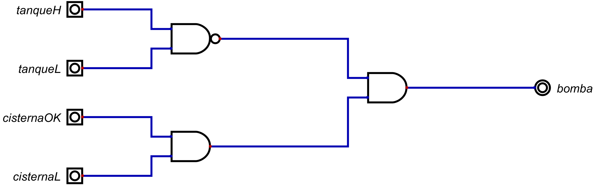

# Informe de Desarrollo de un Controlador Digital de Bomba de Agua

Electrónica IV - TP - Automatismos y Máquinas Elementales

## Introducción

El controlador de bomba de agua se basa en poder conseguir que un tanque se llene de manera automatica entre ciertos niveles
de agua y lograr que cuando este lo necesite se vuelva a cargar por si solo sin dejar que la cisterna se decebe.
## Metodología de trabajo

Para realizar el diseño principalmente se debe tener en cuenta en que momentos se debe cargar y dejar de cargar el tanque, por ello se utilizo una AND
para determinar que valores deberian generar que la bomba se active, por ejemplo, esta se debe activar cuando la cisterna este en condiciones de comenzar a cargar
el agua en caso de que este por debajo de su nivel bajo la bomba no debe activarse, de igual forma se tiene que tener en cuenta que la bomba no debe activarse si 
se supero el nivel maximo del tanque, para realizar esto se utilizo una compuerta NAND de tal forma que cuando este por debajo del maximo nos de un 1 y solo de un cero 
si se encuentra por encima del nivel maximo, y la bomba actuara solo cuando se cumplan ambas condiciones.
## Resultados

El circuito obtenido es el siguiente:

## Conclusiones

El controlador de la bomba es un tipo de automatismo, ya que esta busca automatizar el cargado y descargado del tanque. Por ello se puede ver que al cargar la cisterna 
el tanque comienza a cargarse y vuelve a realizar esto apenas comienza a descargarse.