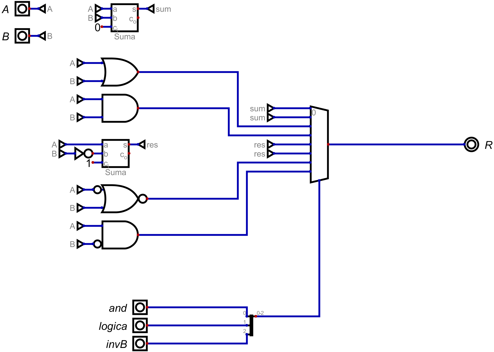

# Informe de Desarrollo de una Unidad Aritmética Lógica (ALU) de 16 bit

Electrónica IV - TP - Automatismos y Máquinas Elementales

## Introducción

La ALU tiene como funcion principal realizar las siguientes operaciones basicas:
1- Realizar la suma entre dos señales de 16 bits.
2- Realizar la resta entre dos señales de 16 bits, obteniendo a la salida la expresion correcta con su respectivo signo.
3- Realizar la suma logica entre las señales A y B, ademas de tambien poder realizar la suma logica entre A y el negado de B.
4- Realizar el producto logico entre dos señales A y B, como asi tambien entre la señal A y el negado de B.

Para ello la ALU cuenta con dos entradas de 16 bits una para una señal A y otra para una B, con las cuales se trabajaran de manera interna.
Para lograr escoger que operacion se desea realizar se posee tres switches con los cuales mediante una serie de codigos se puede acceder a la operacion
deseada.
De esta forma al determinar ambas señales y eligiendo la operacion a realizar, la ALU automaticamente realizara dicha operacion.

## Metodología de trabajo

Para diseñar la ALU, como primera medida se tuvo que tener en consideracion como se seleccionarian las distintas operaciones, por lo tanto, se opto por 
utilizar un multiplexor con un seleccionador de 3 bits para lograr todas las combinaciones necesarias, asi tambien configurando que este sea capaz de trabajar
con la cantidad de bits que sera la entrada. Luego de realizar el multiplexor se colocaron los distintos elementos en las correspondientes entradas de este.
Para la realizacion de las sumas y productos logicos se utilizaron la correspondientes compuertas negando la entrada correspondiente cuando era requerido, de
esta forma se usaron dos compuertas AND para el producto logico, de las cuales una de ellas tenia negada la entrada de la señal B y asi conseguir el producto de 
A con B negada (A*~B). Para el caso de la compuerta OR se realizo lo mismo, aunque a la hora de hacer A mas B negada (A+~B) se tuvo un problema cuando se intento
proceder de la misma forma que con las compuertas AND, ya que se producia un error al intentar poner la compuerta OR con la entrada B negada, por ello, se decidio 
negar la entrada A y utilizar una compuerta NOR, de esta forma se obtiene el mismo resultado.
Para lograr hacer la operacion de suma y resta se utilizo el sumador que viene por defecto en el simulador. En el caso de la suma simplemente se conectaron las
entradas segun correspondia y se agrego un valor constante en el carry (0), asi se consiguio efectuar la suma de manera correcta. Para el caso de la resta los unicos
cambios que se realizaron fueron negar la entrada B y utilizar un 1 como valor constante en el carry, pues la resta se puede ver como A mas el complemento a 2 de B, 
este ultimo se consigue al negar B y sumarle un 1 que fue exactamente lo que se hizo.

## Resultados

En la siguiente imagen se puede apreciar el esquematico de la ALU:

Con el circuito anterior se logro realizar lo pedido en el enunciado.
## Conclusiones

La unidad aritmetica Logica podria contemplarse como una computador puesto que no realiza operaciones de manera automatica ya que necesita de un operador 
que introduzca los numeros y determine que operacion se esta realizando, pero tampoco contaria como maquina elemental puesto que no realiza una unica tarea 
por lo tanto calificaria mas como un tipo de computadora.